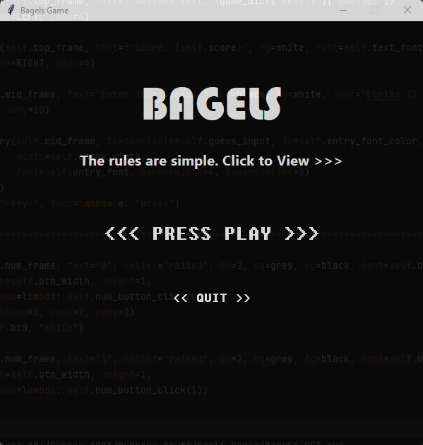

# Mary-Ann Egbudom
*Data Engineer | Python Developer*

# Contact Information

- LinkedIn - [Mary-Ann Egbudom](https://www.linkedin.com/in/mary-ann-egbudom-9017b3109)
- Twitter - [@Rianne_egb](https://twitter.com/Rianne_egb)
- GitHub - [@purplerayray](https://github.com/purplerayray)
- Email Address - [ma.egbudom@gmail.com](mailto:ma.egbudom@gmail.com)

# Education
* Msc Data Science and Artificial Intelligence, *University of Hull*, 2022-2023
* Trainee (Python Programming), *New Horizons Institute*, 2021-2022
* Bachelors of Engineering (Computer Engineering), *Covenant University*, 2014-2019

# Projects
## [Customer Data Processing Project](https://github.com/purplerayray/customer-data-processing-project)

> Photo by <a href="Image by <a href="https://pixabay.com/users/mediamodifier-1567646/?utm_source=link-attribution&utm_medium=referral&utm_campaign=image&utm_content=3033203">Mediamodifier</a> on <a href="https://pixabay.com//?utm_source=link-attribution&utm_medium=referral&utm_campaign=image&utm_content=3033203">Pixabay</a>

A customer data processing task using Python to help businesses gain valuable insights into customer behavior and preferences, which can inform marketing strategies and improve customer satisfaction.

#### Technologies:

- Python
- Jupyter Notebook
- Excel
- JSON

 

---

## [Automatic Car Parking System (Desktop Application)](https://github.com/purplerayray/automatic-car-parking-system)

> Photo by <a href="https://unsplash.com/@adityareds?utm_source=unsplash&utm_medium=referral&utm_content=creditCopyText">Aditya Rathod</a> on <a href="https://unsplash.com/s/photos/car-park?utm_source=unsplash&utm_medium=referral&utm_content=creditCopyText">Unsplash</a>

This is a desktop based (client/server) Automatic Car Parking system that assigns slots to cars, the project incorporates Sqlite3 database system to record events and entities. It is entirely written in Python and the Graphic User Interface was designed with Tkinter library. The application collects plate numbers as a unique identifier and assigns an equally unique slot number to the vehicle. At the car's exit, total time parked is calculated and the bill is automatically generated.

#### Technologies:

- Python3
- Tkinter Library
- Sqlite3
- PyCharm

 

---

## [Bagels Game](https://github.com/purplerayray/bagels-game-repo)

> Bagels is a deductive logic game by Al Sweigart al@inventwithpython.com.  

It has been built upon with the following added features:
- Graphic User Interface with Tkinter library
- An automatic score calculator
- A counter for the number of guesses left
- Six difficulty levels
- A color scheme for each level

#### Technologies:

- Python3
- Tkinter Library
- PyCharm

 

  
